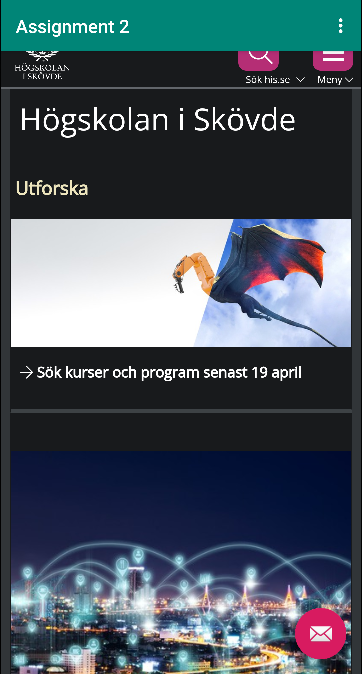
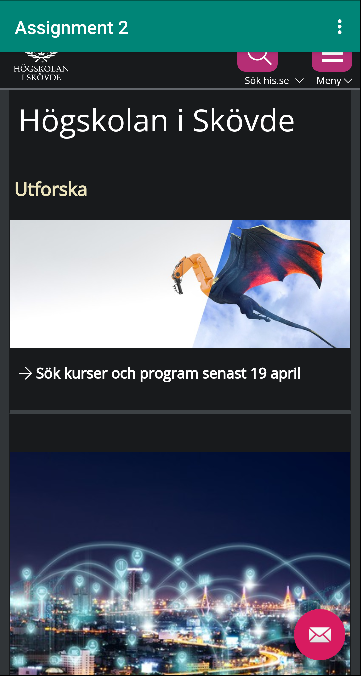

# Rapport

Assignment 2

I denna uppgift har jag ändrat namnet på appen i strings.xml, och har gett den internetåtkomst i AndroidManifest.xml.
Sedan skapade jag ett WebView element och gav den ett ID. 
Nästa steg var att skapa WebView funktionen i Main och sedan hitta WebView elementet i content_main med hjälp av findViewById.
Efter det skulle Javascript tillåtas och en html sida läggas till som en asset.
Sista steget var att lägga in koden som laddar in hemsidan i showExternalWebPage och showInternalWebPage och kalla på de med hjälp av onOptionsItemSelected.

Detta är koden som tillåter att hemsidan visas.
```
    WebView myWebView;

    public void showExternalWebPage(){
        myWebView.loadUrl("https://his.se");
    }

    public void showInternalWebPage(){
        myWebView.loadUrl("https://his.se");
    }

    @Override
    protected void onCreate(Bundle savedInstanceState) {
        super.onCreate(savedInstanceState);
        setContentView(R.layout.activity_main);
        Toolbar toolbar = (Toolbar) findViewById(R.id.toolbar);
        setSupportActionBar(toolbar);

        myWebView = findViewById(R.id.my_webview);
        myWebView.setWebViewClient(new WebViewClient());
        WebSettings webSettings = myWebView.getSettings();
        webSettings.setJavaScriptEnabled(true);
```

Bilder läggs i samma mapp som markdown-filen.



Läs gärna:


